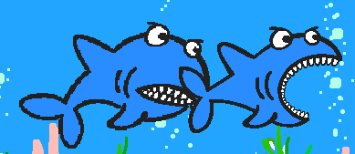
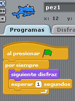

# Aparencia

## Tercer paso

Ahora lo que vamos a hacer es que ...

****El tiburón se desplace con sensación de estar "masticando" y poner un escenario adecuado****

Es decir, realizar un programa que:

<li>El sprite shark vaya cambiando de disfraz sin parar.<ol>
1. Como hemos utilizado el sprite shark predefinido de la biblioteca, tiene ya los disfraces de abrir y cerrar la boca

%accordion%Solución%accordion%

%/accordion%