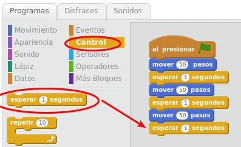
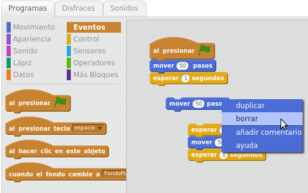

# Bloques

Scratch dispone de un buen número de bloques. En el presente curso sólo vamos a estudiar y utilizar un subconjunto de ellos, serán lo suficientemente significativos para que aprendáis a utilizar Scratch de una forma completa y os permitirá tener una base para que vosotros mismos probéis el funcionamiento de otros bloques.

Si os gustaría tener información sobre todos los bloques impreso, os recomendamos esta guía de Eduteka donde aparece descrito lo que hace cada bloque: [http://www.eduteka.org/pdfdir/ScratchGuiaReferencia.pdf#page=15](http://www.eduteka.org/pdfdir/ScratchGuiaReferencia.pdf#page=15)

## Actividad: Moviendo los bloques

Continuamos con el proyecto que ya funciona. Haz que en vez de 10 pasos, avance 50: Para ello haz clic en el número 10, borra con el teclado el 10 y escribe 50, y pruébalo de nuevo.

Manejando bloques: Observarás que los bloques en la zona del programa se pueden mover.

- Si mueves el bloque naranja "Al presionar bandera", se arrastrará también el bloque azul "mover 50 pasos". 
- Si mueves el bloque azul "mover 50 pasos", se desencajará del bloque superior.

**Los bloques se quedan enlazados, y cuando arrastremos un bloque, con él se moverá todo lo que de él dependa, pero se desprenderá de sus bloques superiores.**

A continuación del bloque azul "mover 50 pasos", añade el bloque "esperar 1 segundo", que está en el los bloques de Programas - Control.

Añade también varios bloques azules más, de forma que queden intercalados, tal y como se muestra en la siguiente imagen, y pruébalo.

## Actividad: Borrando bloques

Para **quitar un bloque (y todo lo que depende de él)**:

- Opción a: Arrástralo de nuevo a la zona de bloques de donde lo arrastraste.
- Opción b: También puedes darle con el "**Botón derecho del ratón - Borrar**".

Para** quitar un bloque que esté encajado en medio de otros bloques:** desencájalo de arriba, desencajale todo lo que tiene abajo, bórralo, y encaja los bloques superiores con los inferiores. En la siguiente imagen se muestra cómo poder borrar el bloque "mover 50 pasos" que está en el medio:

**DESHACER BORRADO: **Si borras un bloque o un conjunto de bloques entero, puedes recuperar lo último que has borrado en el menú **Editar - Recuperar borrado**.

