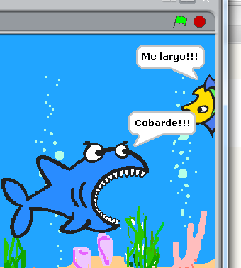
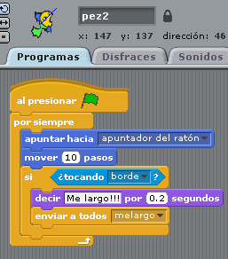
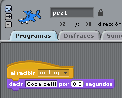

# Cobarde !!!

## Sexto paso

****El tiburón diga "Cobarde" si el pez pequeño se larga****

Es decir, si el pez pequeño se toca el borde (actividad anterior), tiene que enviar un m.... y si el tiburón recibe el m.... entonces que diga Cobarde!! durante también 0.2seg

<input type="button" name="toggle-feedback-95_93" value="Solución" class="feedbackbutton" onclick="$exe.toggleFeedback(this,false);return false" />

### Retroalimentación

Exacto! lo de m.... quería decir **mensaje.  **

El pez pequeño envía un mensaje:

y el tiburón recibe el mensaje y contesta:

