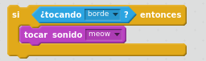
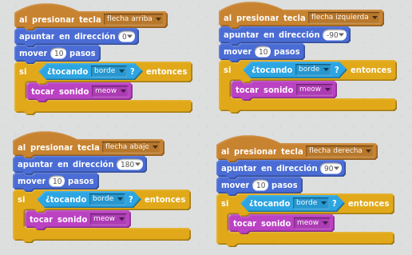

# Control: condiciones

Las condiciones son un tipo de bloques que evalúan algo, y si es cierto, entonces se arrancan los bloques que tiene dentro anidado.

Añade estos bloques y pruébalos dándole a la bandera. (Los bloques verdes están en la pestaña Programas - Operadores). En estos bloques se comprueba que 2+3=5, y como es cierto, entonces el gato dice "SUMA CORRECTA". Si cambias el 5 por cualquier otro valor, por ejemplo 6, la condición de 2+3=6 es falsa, y el gato dice "Hmmm... algo va mal". 

## Caso práctico

<input type="button" name="toggle-feedback-quesFeedback0b136" value="Mostrar retroalimentación" class="feedbackbutton" onclick="$exe.toggleFeedback(this,true);return false" />

### Retroalimentación

Primero hay que crear los bloques que comprueben si estamos tocando el borde, y entonces maullar:

Una posible solución donde añadir la comprobación de tocar el borde, es añadirlo justo después de mover el gato en todas las direcciones.

