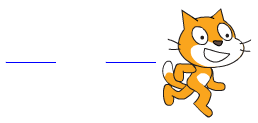
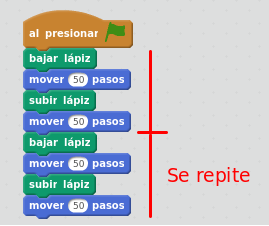
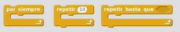
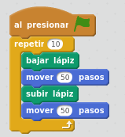
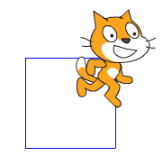
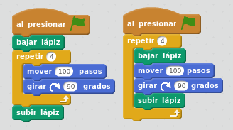
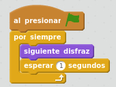

# Control: repeticiones

## Caso práctico

Para empezar a entender qué son las repeticiones, haz un programa que dibuje dos líneas discontinuas.

%accordion%Solución%accordion%

Puedes duplicar los bloques (botón derecho - duplicar) para no tener que construir dos veces lo mismo.

¿Y si hubiera que pintar muchas líneas?: es decir, repetir lo mismo muchas veces. Entonces hay que añadir un bloque de control para hacer repeticiones. Las repeticiones también se llaman "bucles". Es posible añadir 3 tipos de bucles:

- Se repiten constantemente, por siempre.
- Se repiten un número de veces concreto
- Se repiten hasta que se cumple una condición

%/accordion%

## Caso práctico

Haz un programa que dibuje 10 líneas discontinuas seguidas. 

%accordion%Solución%accordion%

%/accordion%

## Caso práctico

Haz un programa que dibuje un cuadrado.

%accordion%Solución%accordion%

Hay dos soluciones posibles de dibujar el cuadrado utilizando el bloque de repeticiones. A continuación se muestran los dos programas posibles. Con que construyas uno de ellos ya tienes la solución. Los bloques de subir y bajar lapiz pueden estar dentro o fuera del bloque de repetición, en este ejemplo el resultado será el mismo.

%/accordion%

## Caso práctico

Haz que el gato vaya cambiando de disfraz constantemente. Añade un retardo de 1 segundo para que el cambio de disfraz sea algo más lento.

%accordion%Solución%accordion%

%/accordion%