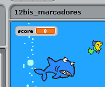
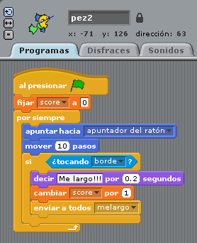

# Dos jugadores

## Ya toca jugar con dos jugadores Paso final, la puntuación

Como la vida misma: Si no hay premio o cuantificamos, no hay animación !

****Idear un sistema de puntuación en el juego****

Por ejemplo podría ser este:

<li>Si el pez grande toca al pequeño:
<ul>
-  el pez grande gana un punto
- suena un "zoop"

- el pez grande gana otro punto

Sí, ya sé que es un poco injusto que el pequeño no gane nada, pero así es la vida...

Se recomienda redimensionar los peces para que sean pequeños

<input type="button" name="toggle-feedback-101_93" value="Solución" class="feedbackbutton" onclick="$exe.toggleFeedback(this,false);return false" />

### Retroalimentación

Creamos una variable que lleve la puntuación, aquí lo hemos llamado "score"

Y el reto es dónde poner la instrucción que va incrementando la puntuación "cambiar score a 1"

En el programa del pez pequeño:

Programa del tiburón

[Descarga del programa](peces.sb)

