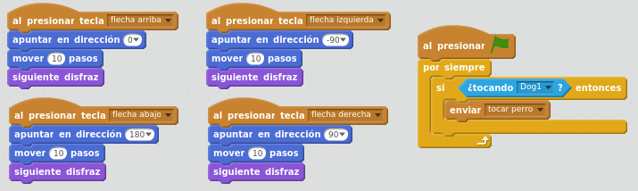
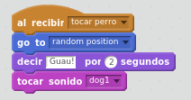

# ¡El primer juego!

## Caso práctico: ¡Vamos a hacer el primer juego!

Con todo lo que hemos visto, ya tenemos todos los ingredientes para hacer un sencillo juego.

Moveremos el gato con las flechas del teclado. el gato cambiará de disfraz para parecer que va andando.

Hacer que cuando el gato toque al perro, el perro se mueva a una posición aleatoria y ladre.

%accordion%Solución%accordion%

En una actividad anterior hemos visto que el bloque "Si....entonces" lo podemos añadir por cuatro veces después de presionar cada tecla. En esta solución se muestra cómo poner estos bloques sólo una vez en un programa independiente dentro de la programación del Gato, y es necesario añadir el bloque "por siempre" para que se esté constantemente comprobando si el gato toca al perro.

**Programación del Gato:**

**Programación del Perro:**

%/accordion%
