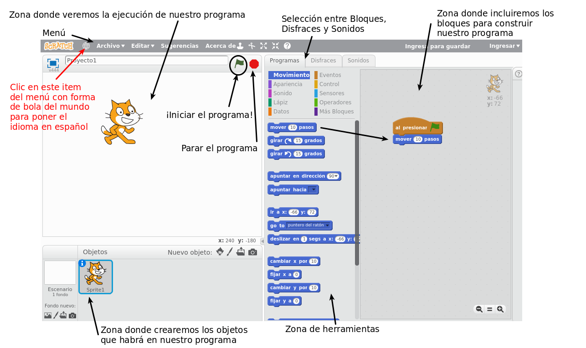

# Entorno Scratch

Una vez que hayas arrancado Scratch en tu ordenador, o que hayas entrado en la web online de Scratch, verás el entorno de trabajo de Scratch. En la siguiente imagen se muestran las diferentes zonas de trabajo de Scratch.

En el primer ítem del menú con forma de bola del mundo se puede cambiar el idioma a español.

Glosario:

- **SPRITE **Es el objeto sobre el cual programamos, en la figura de abajo es el gato, pero podemos incorporar más predefinidos de la biblioteca de Sractch, pintarlos con mapa de bits o vectorial, o incluso desde cámara web.
- **EVENTO** Suceso provocados por el usuario, los sprite o por el sistema, y sobre el cual queremos que el programa se ejecute o haga un comportamiento determinado, por eso en Scrach se dice que su programación es "orientada a eventos". Ejemplo de eventos provocados por ...
<ul>
- **Sprite**: si el gato toca el borde, pues que haga...
- **Usuario** Si se apreta la tecla espacio que ...
- **Sistema**: Si hora actual = 12 que ....

