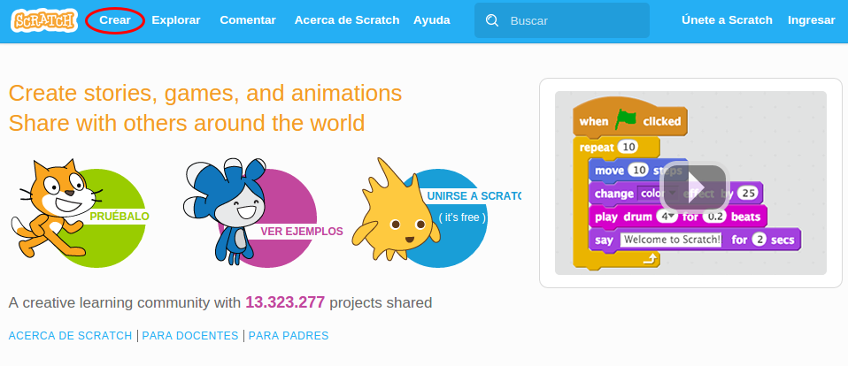

# Instalación

## Dos formas de trabajar en SCRATCH

La web oficial de Scratch es [http://scratch.mit.edu/](http://scratch.mit.edu/)

Hay dos caminos para crear proyectos con Scratch 2:

<li>**Sin necesidad de conexión a Internet: mediante Scratch 2 Offline Editor**
<ul>
- Es el editor de proyectos Scratch que no necesita conexión a Internet para funcionar.
1. Recomendada en caso de existir problemas de conexión. 
1. Los proyectos Scratch se guardan en archivos con extensión .sb2 dentro de nuestro ordenador.
1. [Web oficial de descarga de Scratch 2](https://scratch.mit.edu/scratch2download/)
</ul>
</li>

<li>**Con necesidad de conexión a Internet: mediante **Scratch 2 Online
<ul>
- **Se realiza desde la página oficial [http://scratch.mit.edu/](http://scratch.mit.edu/) en CREAR. (Acceso directo: [https://scratch.mit.edu/projects/editor/](https://scratch.mit.edu/projects/editor/))**
1. Los proyectos Scratch se guardan en la Web de Scratch [http://scratch.mit.edu/](http://scratch.mit.edu/)
1. Para guardar los proyectos realizadosen la Web, es necesario crearse una cuenta de usuario en la web de Scratch .
1. Los proyectos Scratch se pueden exportar y acabar guardados en nuestro ordenador.
1. Permite compartir nuestro proyecto a la comunidad de "Scratchers".
1. Permite "embeber" el proyecto en una página web. [Ver cómo hacerlo](http://wiki.scratch.mit.edu/wiki/How_to_Embed_a_Project).
</ul>
</li>

## **¿Qué opción es la más recomendable?**

Lo mejor es la versión OnLine, sólo recomendamos utilizar la versión Offline si hay problemas de conexión de Internet.

