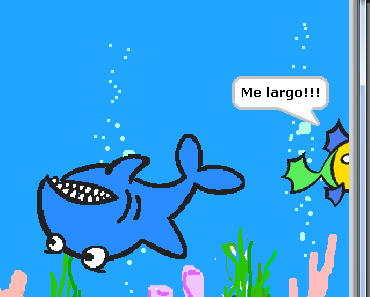
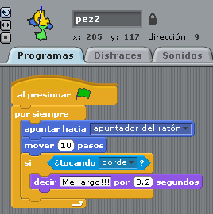

# Me largo!!!

## Quinto paso

****El pez pequeño si toca un borde que diga que se larga!****

Por ejemplo el mensaje puede ser "Me largo !" durante 0.2 seg

<input type="button" name="toggle-feedback-72_93" value="Solución" class="feedbackbutton" onclick="$exe.toggleFeedback(this,false);return false" />

### Retroalimentación

