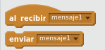
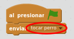

# Mensajes

Podemos comunicar dos programas a través del envío de mensajes. Se puede enviar un mensaje desde un programa de un objeto a otro, para hacer en él alguna acción. Estos bloques se encuentran en "Eventos".

## Caso práctico

Vamos a hacer que cuando el gato toque al perro, enviemos un mensaje desde un programa del gato hasta un programa del perro. Cuando el perro reciba el mensaje, lo cambiaremos de posición, a una posición aleatoria.

%accordion%Solución%accordion%

Al presionar Bandera, el objeto Gato envia un mensaje, lo recibimos en el objeto Perro, y hacemos que el perro se mueva a una posición aleatoria en pantalla

Programa a añadir en el Gato:

Programa a añadir en el Perro:

%/accordion%