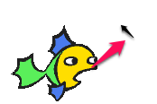
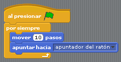

# Movimiento pez

## Vamos allá primer paso ....

El primer paso que vamos a hacer es :

****Realizar un programa para conseguir que el "pez persiga al ratón"** **

1. Insertar un SPRITE predeterminado que se llama "fish2" (en biblioteca - sección animales)
1. Crear un programa que siempre persiga la posición del ratón

Guardalo que lo utilizaremos más adelante

%accordion%Solución%accordion%

%/accordion%
