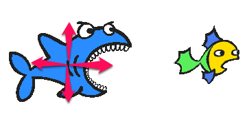
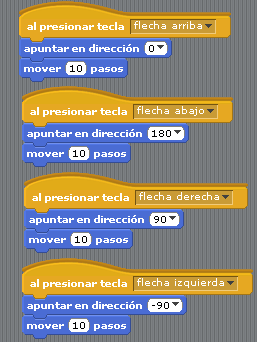

# Movimiento tiburón

## Segundo paso

Hora vamos a añadir un

****Un tiburón que se mueva según apretemos las teclas de flechas del teclado****

1. En el mismo programa, añade el sprite de la biblioteca Shark
1. Haz un programa al sprite Sharck que se mueva según las flechas del teclado (pista: Ya lo vimos ;)

Guardarlo en el mismo fichero!!!

<input type="button" name="toggle-feedback-91_93" value="Solución" class="feedbackbutton" onclick="$exe.toggleFeedback(this,false);return false" />

### Retroalimentación

