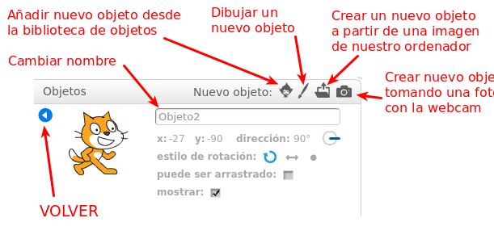
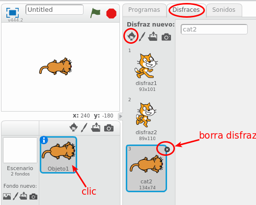

# Objetos, Disfraces y Fondos

## Actividad: OBJETOS

Un nuevo proyecto viene con un objeto: es un Gato. Se puede cambiar el nombre al objeto, dándole con el Botón derecho - Info y luego cambiándole el nombre en el recuadro.

Añade un nuevo objeto desde la biblioteca de objetos, en concreto el objeto "Dog1". Está en la categoría Animales.

## Actividad: DISFRACES

Cada objeto puede tener muchos disfraces. El Gato por defecto viene con 2 disfraces. Podemos añadir un nuevo disfraz a un objeto.

Añade un nuevo disfraz al objeto Gato: Primero haz clic en el objeto Gato. luego añade el disfraz Cat2 al objeto Gato desde la biblioteca de disfraces.

También podemos borrar disfraces: Borra el disfraz que acabas de añadir.

## Actividad: FONDOS

Inicialmente el fondo es blanco. Podemos tener preparadas varias imágenes que podemos hacer que sean el fondo del programa.

Añade un fondo de la biblioteca de fondos, por ejemplo el fondo "blue sky".

