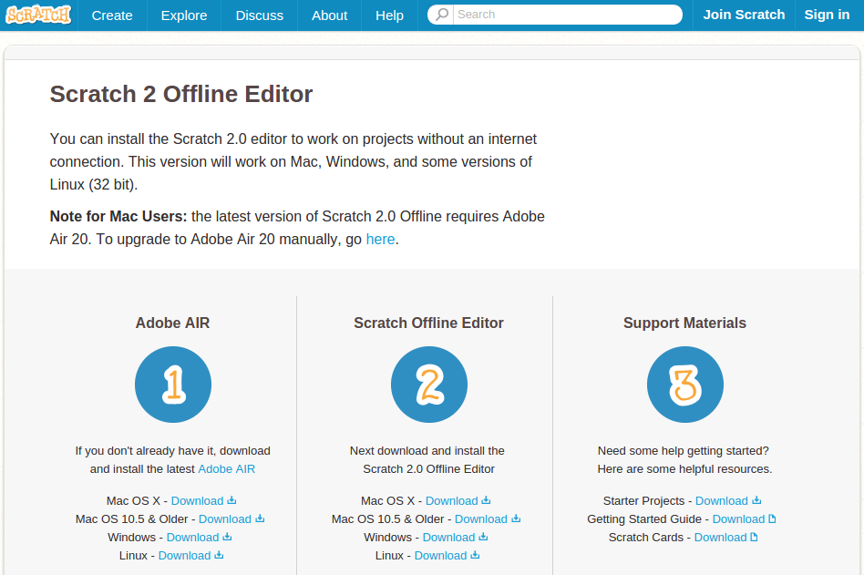

# Off-Line

## Actividad: Instalar Scratch 2 Offline Editor

Entra en la web de Scratch [https://scratch.mit.edu/](https://scratch.mit.edu/)

Al final de esa página está el enlace "Editor sin Conexión", haz clic en él. Si no lo encuentras, puedes ir directamente a la web de descarga del [Editor sin Conexión (https://scratch.mit.edu/scratch2download/)](https://scratch.mit.edu/scratch2download/): 

1. Instala Adobe Air
1. Instalar Scratch Offline Editor
1. No es necesario que descargues los materiales de soporte del paso 3, pero son material complementario y de ayuda que te servirán para profundizar en Scratch
1. ¡Arranca Scratch en tu ordenador!

También existe una versión para Android llamada ScratchJr [[Ver](https://play.google.com/store/apps/details?id=org.scratchjr.android)]. Es una versión reducida pensada para alumnos de infantil.

**Sobre la versión anterior Scratch 1.4:**

- Los proyectos de Scratch 1.4 se guardan en archivos con extensión .sb 
- Un proyecto realizado en Scratch 2.0 (extensión .sb2) puede convertirse en 1.4 (extensión .sb) usando [Retro Converter](http://kurt.herokuapp.com/20to14) pero algunos módulos propios de la versión 2.0 no se convertirán. [Ver página con información.](http://wiki.scratch.mit.edu/wiki/Porting_Scratch_Projects)
- Un proyecto realizado en Scratch 1.4 se puede abrir en 2.0
- Un fichero .sb se puede convertir en un ejecutable exe de Windows o App en Mac o en un JAR Java ejecutable [Ver página.](http://wiki.scratch.mit.edu/wiki/Porting_Scratch_Projects)

**Curiosamente no es posible compartir proyectos de S4A en la web de la comunidad Scratch, ya que ésto violaría los términos y condiciones de uso de Scratch. S4A es una modificación de Scratch para programar la plataforma hardware Arduino.**

