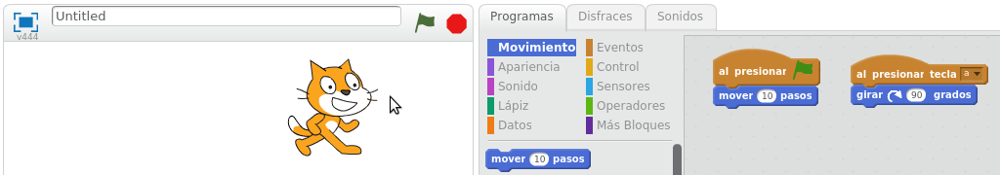
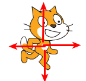
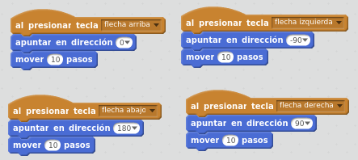
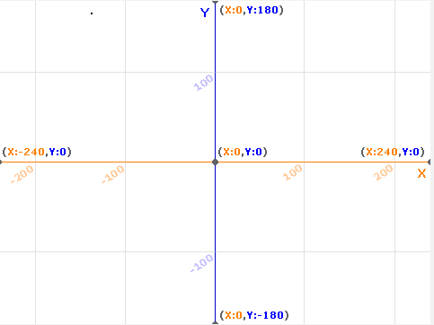
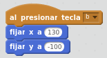

# Programas y Movimiento

## Actividad: Añadir otro programa

Si ya has trasteado mucho, cada vez que lo necesites, puedes volver a empezar un nuevo proyecto en blanco. Dale a menú **Archivo - Nuevo** para iniciar un nuevo proyecto, o también puedes ir borrando lo que ya no necesites.

Vamos a añadir que al presionar la tecla "a", el objeto se gire 90 grados:

1. Habrá que utilizar un bloque de Eventos, en concreto el bloque "**al presionar tecla espacio**" Pongo en cursiva espacio porque lo podremos cambiar. Haciendo clic en "**espacio**", podremos cambiarlo por "**a**".
1. Se necesita también el bloque de Movimiento "mover 10 pasos". Haciendo clic en el **10**, podríamos ponerle 100 para que avance más.

**Observad que hay 2 programas en la zona derecha. Cada objeto puede tener varios programas, que funcionan de forma paralela.**

**IMPORTANTE: Los programas se identifican por empezar con un bloque de "Eventos" cuya parte superior es ovalada.**

## Caso práctico

El objeto se mueve en la dirección en la que apunta. Hay un bloque que hace que el objeto apunte a otra dirección:

Haz que el objeto se mueva según las flechas de teclado.

%accordion%Solución%accordion%

%/accordion%

## Caso práctico

La posición de un objeto se controla con coordendas X e Y. La posición de estas coordenadas en la pantalla es la siguiente:

Esta imagen es un Fondo que ya está creado en Scratch, y que puedes añadir a tu proyecto.

Añade este programa.

¿Qué hace este programa?

%accordion%Solución%accordion%

 Este programa mueve el objeto a la zona inferior derecha de la pantalla cuando se presiona la tecla b.

%/accordion%