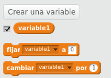
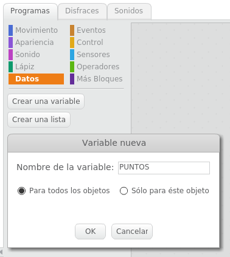
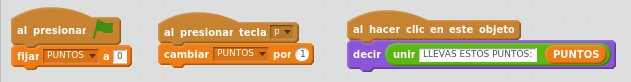

# Variables

Las variables las podemos entender como un "nombre" que contiene un "valor". Podremos asignar un valor a la variable. Y podremos recuperar el valor de la variable. Al crear una variable, aparecen los bloques de control de las variables, en "Datos".

## Caso práctico

Crea una variable y ponle de nombre PUNTOS

%accordion%Solución%accordion%

- Haz que al iniciar el juego se ponga el valor de PUNTOS a 0
- Haz que al presionar la tecla "p" se incremente en 1 el valor de PUNTOS
- Haz que al hacer clic encima del Gato, el gato diga el valor de PUNTOS

%/accordion%

%accordion%Solución%accordion%

%/accordion%
