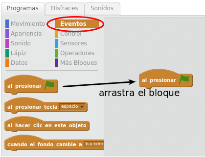
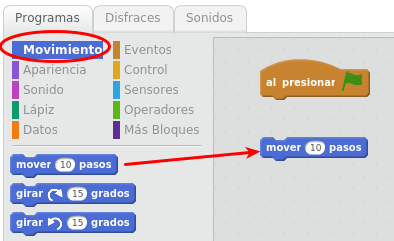
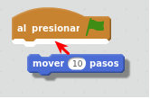
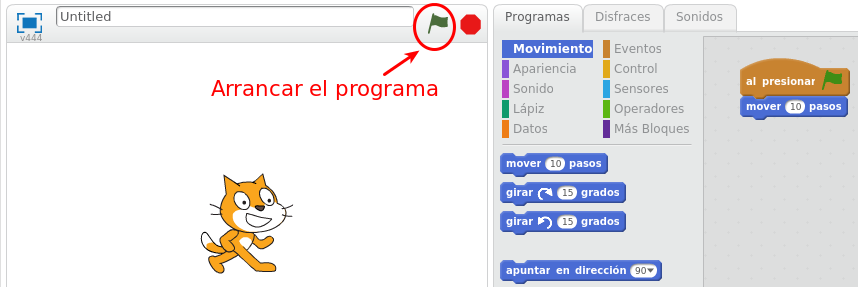

# ¡Ya funciona!

## Actividad: ¡Ya funciona!

Vamos a hacer nuestro primer programa en Scratch:

1 Clic en la pestaña Programas - Eventos
2 Arrastra el bloque "Al presionar bandera": 

3 Clic en en la pestaña Programas - Movimiento
4 Arrastra el bloque "mover 10 pasos" a la zona derecha y encájalo arrastrándolo justo debajo del bloque "Al presionar bandera":

 Y ¡ENCAJALO!

5 Haz clic en la bandera verde para iniciar el programa:

¡Verás que el gato Scratch se mueve un poco hacia la derecha! Se mueve 10 pasos, correspondientes a 10 píxeles. 

El programa termina sólo porque ha terminado de ejecutar todas las instrucciones. Por ello no hay que darle al botón Stop rojo (al lado de la bandera verde) para que finalice. El botón Stop servirá cuando nuestro programa tenga bloques de control que impliquen repetición continua de ejecución (esto se verá más adelante). 

